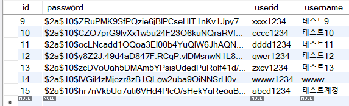
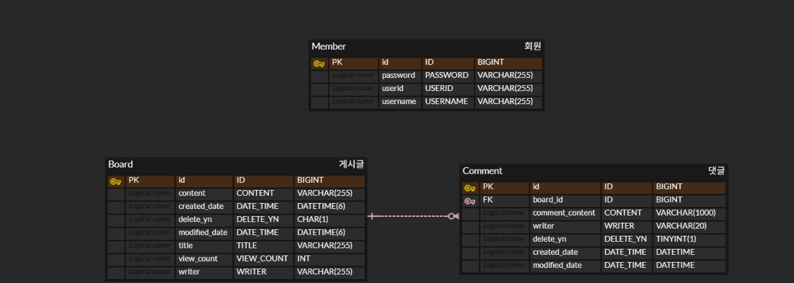

# Spring-boot Board App

(시연 영상 링크)
https://share.vidyard.com/watch/yq5GEsppKx3d4Nm6BX61mv

<br></br>
## 프로젝트 개요

Spring Boot와 JPA, MyBatis를 활용하여 게시글과 댓글의 CRUD 기능을 제공하는 게시판 웹 애플리케이션입니다.
회원 인증·인가의 경우 Spring Security의 일부 기능을 활용하여 구현하였습니다.

<br></br>
## 기술 스택

### BackEnd
- JAVA 17(Spring Boot 호환을 위한 설정, 실제 기능 구현은 JAVA 8 기능 위주)
- Spring Boot
- Spring Security
- JPA
- MyBatis


### Database
- MySQL


### FrontEnd
- HTML/CSS/JavaScript
- Thymeleaf
- BootStrap 5


### Build & IDE tool
- IntelliJ IDEA
- Gradle

<br></br>
## 주요 기능

### 회원 관리
+ **회원가입** : BCryptPasswordEncoder를 활용하여 비밀번호를 암호화 하여 DB에 반영

  
+ **로그인** : UserDetails 인터페이스를 활용하여 작성자(사용자) 인증(Authentication) 처리
  
+ **권한 부여** : 작성자만이 본인의 게시글 및 댓글 수정·삭제 가능하도록 인가(Authorization) 처리. URL 직접 접근을 통한 수정·삭제 요청도 서버 단에서 처리.

+ **로그아웃** : Spring Security가 기본적으로 제공하는 LogoutFilter를 통한 내부 처리로 구현. 별도의 커스터마이징은 하지 않았습니다.

### 게시글
+ **게시글 작성/단건 조회/수정/삭제/조회수 증가** : jpaRepository를 상속받는 BoardRepository 인터페이스를 기반으로 Service Layer에서 처리. 게시글 삭제의 경우 물리적인 삭제(레코드 삭제)가 아닌 논리적 삭제(Y/N 여부)로 구현.

+ **게시글 리스트 조회** : 조건 검색 및 페이징 등 조회 로직의 확장 가능성이 있어 MyBatis 기반 Mapper를 통해 별도 처리

### 댓글
+ **댓글 작성/단건 조회/수정/삭제** : 복잡한 도메인 규칙이 없고, SQL 제어가 용이한 단순 CRUD 중심의 특성으로 인해 MyBatis 기반으로 구현

+ **댓글 리스트 조회** : 게시글과 페이징 로직이 동일하고, 마찬가지로 조회 로직의 확장 가능성을 고려해 동일하게 MyBatis 기반으로 처리

<br></br>
## 프로젝트 구조
```text

com.example.PortfolioV1 
 ├─ controller
 │   ├─ BoardController
 │   ├─ BoardApiController
 │   └─ MemberController
 ├─ service
 │   ├─ BoardService
 │   └─ MemberService
 ├─ repository
 │   ├─ BoardRepository
 │   └─ MemberRepository
 ├─ domain
 │   ├─ Board
 │   ├─ Member
 │   └─ Comment
 ├─ dto
 │   ├─ BoardRequestDto
 │   └─ BoardResponseDto
 └─ config
     └─ SecurityConfiguration
```

- Controller : 클라이언트 요청 처리 및 View(또는 JSON 응답)를 반환

- Service : 비즈니스 로직 담당(트랜잭션 단위로 동작)

- Repository : 데이터 접근 계층(JPA/MyBatis)

- Domain : 핵심 도메인 모델 및 관련 로직 표현

- DTO : 계층 간 데이터 전달을 위한 객체

- Config : Spring Security 등의 애플리케이션 설정 정보


<br></br>
## ERD



### ERD 설계

초기 단계에 ERD를 선행하지 않고 기능 구현 위주로 DB 구조가 설계되었습니다.
그 결과 게시글 테이블과 댓글 테이블의 경우 연관관계 형성이 되어있으나, 회원 테이블의 경우 다른 엔티티와 연관관계를 맺지 못하고 고립된 구조로 설계되었습니다.

이를 토대로 ERD 선행 설계의 중요성을 인지하였고 향후 요구사항 분석 단계에서 ERD 설계 후
각 테이블들의 연관관계를 유기적으로 반영할 예정입니다.
