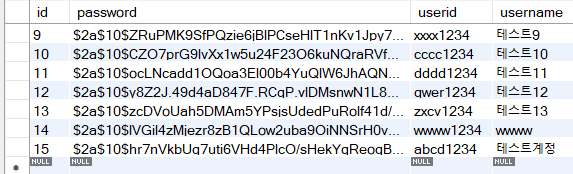
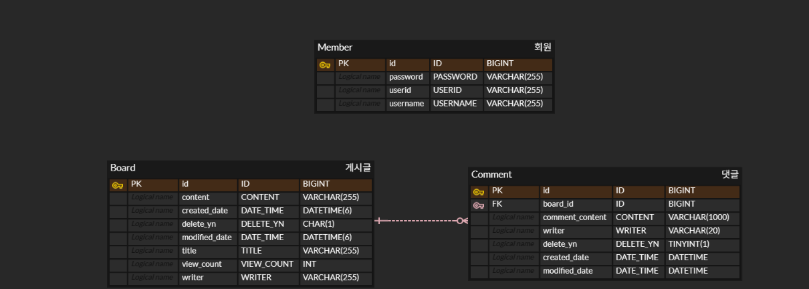

# Spring-boot Board App

(배포 링크 - Render) <- 다만 15분 이상 미사용 시 Sleep이 발생하여 시연 영상 링크를 남겨두었습니다.

https://my-spring-board.onrender.com/

(시연 영상 링크)

https://share.vidyard.com/watch/yq5GEsppKx3d4Nm6BX61mv

<br></br>
## 프로젝트 개요

Spring Boot와 JPA, MyBatis를 활용하여 게시글과 댓글의 CRUD 기능을 제공하는 게시판 웹 애플리케이션입니다.
회원 인증·인가의 경우 Spring Security의 일부 기능을 활용하여 구현하였습니다.

<br></br>
## 기술 스택

### BackEnd
- JAVA 17(Spring Boot 호환을 위한 설정, 실제 기능 구현은 JAVA 8 기능 위주)
- Spring Boot
- Spring Security
- JPA
- MyBatis


### Database
- MySQL


### FrontEnd
- HTML/CSS/JavaScript
- Thymeleaf
- BootStrap 5


### Build & IDE tool
- IntelliJ IDEA
- Gradle

<br></br>
## 주요 기능

### 회원 관리
+ **회원가입** : BCryptPasswordEncoder를 활용하여 비밀번호를 암호화 하여 DB에 반영

  
+ **로그인** : UserDetails 인터페이스를 활용하여 작성자(사용자) 인증(Authentication) 처리
  
+ **권한 부여** : 작성자만이 본인의 게시글 및 댓글 수정·삭제 가능하도록 인가(Authorization) 처리. URL 직접 접근을 통한 수정·삭제 요청도 서버 단에서 처리.

+ **로그아웃** : Spring Security가 기본적으로 제공하는 LogoutFilter를 통한 내부 처리로 구현. 별도의 커스터마이징은 하지 않았습니다.

### 게시글
+ **게시글 작성/단건 조회/수정/삭제/조회수 증가** : jpaRepository를 상속받는 BoardRepository 인터페이스를 기반으로 Service Layer에서 처리. 게시글 삭제의 경우 물리적인 삭제(레코드 삭제)가 아닌 논리적 삭제(Y/N 여부)로 구현.

+ **게시글 리스트 조회** : 조건 검색 및 페이징 등 조회 로직의 확장 가능성이 있어 MyBatis 기반 Mapper를 통해 별도 처리

### 댓글
+ **댓글 작성/단건 조회/수정/삭제** : 복잡한 도메인 규칙이 없고, SQL 제어가 용이한 단순 CRUD 중심의 특성으로 인해 MyBatis 기반으로 구현

+ **댓글 리스트 조회** : 게시글과 페이징 로직이 동일하고, 마찬가지로 조회 로직의 확장 가능성을 고려해 동일하게 MyBatis 기반으로 처리

### Restful 설계 및 비동기 API 처리
+ 게시글 및 댓글을 하나의 자원(Resource)으로 정의하고 URI는 자원을 식별, HTTP Method는 행위를 표현하도록 설계

+ 비동기 요청을 통해 페이지 리로드 없이 게시글 및 댓글 생성·수정·삭제 처리. 비동기 요청의 결과는 HTTP 상태 코드를 기준으로 판단하여 GlobalExceptionHandler를 통해 표준화 된 ErrorResponse(JSON)을 반환.

<br></br>
## 주요 기술적 의사 결정 및 문제 해결 과정

### 회원(Member) 도메인
+ **Case 1** : 기존 전통적인 회원가입 과정에서 DB로 회원의 암호를 저장 -> 평문 상태의 비밀번호가 그대로 노출 -> 관리자에게 노출되거나 DB 유출 시에 대한 최소한의 예방책으로 BCryptPasswordEncoder 도입하였습니다.

+ **Case 2** : JPQL로 쿼리문을 작성했을 때의 생산성 저하(코드 작성의 증가) 및 문자열 쿼리문으로 인해 컴파일 시점에서 오타와 같은 문제 -> 복잡한 통계 쿼리나 다수 테이블의 조인 상황이 아닌, findByUserid 등과 같은 단순 쿼리문을 사용하는 상황 -> public interface MemberRepository extends JpaRepository<Member, Long> 코드를 통해 JPA Query Method 를 사용하였습니다.

+ **Case 3** : JPA의 지연 로딩(Lazy Loading) 전략 사용 시, 실제 엔티티 대신 가짜 객체 프록시(Proxy)를 참조할 때 이때의 프록시 객체는 내부 필드 값이 비어있는(null) 상태일 수 있음 -> 자신의 게시글 삭제 권한에 대한 실패(equals시 false 반환으로 인한)라는 잠재적 문제를 예방하기 위해 식별자(PK)인 id필드로 한정했습니다.

+ **Case 4** : 만약 예기치 못하게 서버 응답이 느려지는 등의 이유로 회원가입 버튼을 연타하게 되거나, 악의적으로 누군가가 선착순 쿠폰을 받기 위해 동시 요청의 회원가입을 발생시킴 -> if (checkedMember.isPresent()) 과 같은 코드 즉 자바 레벨에서의 코드로는 멀티 쓰레드 환경에서 취약함을 발견(Race Condition) -> 처음에는 트랜잭션을 Serializable로 격리성 수준을 올렸지만, Deadlock(교착상태)의 문제에 대한 인지 -> userid에 유니크 제약 조건을 통해 해결 -> 작은 경험이었으나 멀티 쓰레드 환경에서의 데이터 정합성 보장의 중요성을 인지할 수 있었고, 그와 동시에 이런 설계의 관점에서 부족함을 많이 느끼고 나아갈 방향성을 느꼈던 계기였습니다.

### 게시글(Board) 도메인
+ **Case 1** : 기존의 방식으로 게시글에 대한 관리를 진행했을 때, 현재 수정/삭제 로직으로는 단순히 Postman 등을 통해 작성자의 계정ID만으로 다른 작성자의 게시글 위조가 가능하다는 취약점에서 시작 -> @AuthenticationPrincipal을 통해 스프링 시큐리티 필터에서 먼저 가로채서 검증된 사용자 정보를 통해 게시글 관리하도록 하였습니다.

+ **Case 2** : 직·간접적으로 비즈니스 로직이 SQL에 의존할 수 있는 잠재적인 문제(수정 쿼리를 계속 추가해나가야 하는 등)를 인지, 그와 동시에 영속성 컨텍스트에서 dirty checking(변경 감지)를 학습하면서 흐름을 직접 확인하기 위함 -> 로딩 시점에서 수정 쿼리 생성해둔 뒤 사용하는 즉 재사용성의 장점을 파악하였습니다.

+ **Case 3** : 단순 CRUD의 경우 JPA를 사용하고, 게시글 리스트(findAll)의 경우 Mybatis를 사용한 이유 -> 첫 번째로 QueryDsl 등의 추가 도구 없이 직관적으로 <if>, <where> 태그 등으로 작성할 수 있었기 때문입니다. -> 두 번째로 JPA는 영속성 컨텍스트에 엔티티 전체를 올린다는 것을 알았습니다. 반면 Mybatis의 경우 필요한 필드만 담긴 DTO를 바로 매핑해서 가져오므로 성능상 이점이 있을 수 있기 때문이 그 이유입니다. -> 향후 성능 튜닝과 복잡한 통계성 쿼리 경험을 통해 그 이점을 확실히 체감해보고 싶습니다.

### 댓글(Comment) 도메인
+ **Case 1** : 게시글과의 구조적인 차이로는 댓글의 경우 게시글 리스트(findAll)뿐만 아니라 단순 CRUD 또한 Mybatis를 사용 -> 게시글은 댓글과 첨부파일 등으로 연관 관계가 복잡해질 잠재적인 가능성을 고려했을 때 그래프 탐색과 영속성 컨텍스트 이점 때문에 JPA 사용 -> 그렇다면 댓글의 경우에는 단순히 텍스트로만 작성된다고 가정 -> 상대적으로 구조가 단순하기 때문에 JPA를 사용하지 않고 Mybatis로만 사용 -> Mybatis의 경우 명시적으로 update() 문을 작성해야 한다는 점과 XML과 Java 간의 매핑 오류를 컴파일 단계에서 파악하기 어려웠습니다. -> 향후 복잡한 join 시와 대량 데이터 처리 시에 JPA와 Mybatis 차이점을 좀 더 명확하게 보려고 합니다. (성능 튜닝 시 차이? N+1 문제? 등 나아갈 방향성을 보았음)

### 아키텍처 설계 및 공통 전략
+ (ING~)

<br></br>
## 프로젝트 구조
```text

com.example.PortfolioV1 
 ├─ controller
 │   ├─ BoardController
 │   ├─ BoardApiController
 │   └─ MemberController
 ├─ service
 │   ├─ BoardService
 │   └─ MemberService
 ├─ repository
 │   ├─ BoardRepository
 │   └─ MemberRepository
 ├─ domain
 │   ├─ Board
 │   ├─ Member
 │   └─ Comment
 ├─ dto
 │   ├─ BoardRequestDto
 │   └─ BoardResponseDto
 └─ config
     └─ SecurityConfiguration
```

- Controller : 클라이언트 요청 처리 및 View(또는 JSON 응답)를 반환

- Service : 비즈니스 로직 담당(트랜잭션 단위로 동작)

- Repository : 데이터 접근 계층(JPA/MyBatis)

- Domain : 핵심 도메인 모델 및 관련 로직 표현

- DTO : 계층 간 데이터 전달을 위한 객체

- Config : Spring Security 등의 애플리케이션 설정 정보


<br></br>
## ERD



### ERD 설계

초기 단계에 ERD를 선행하지 않고 기능 구현 위주로 DB 구조가 설계되었습니다.
그 결과 게시글 테이블과 댓글 테이블의 경우 연관관계 형성이 되어있으나, 회원 테이블의 경우 다른 엔티티와 연관관계를 맺지 못하고 고립된 구조로 설계되었습니다.

이를 토대로 ERD 선행 설계의 중요성을 인지하였고 향후 요구사항 분석 단계에서 ERD 설계 후
각 테이블들의 연관관계를 유기적으로 반영할 예정입니다.
